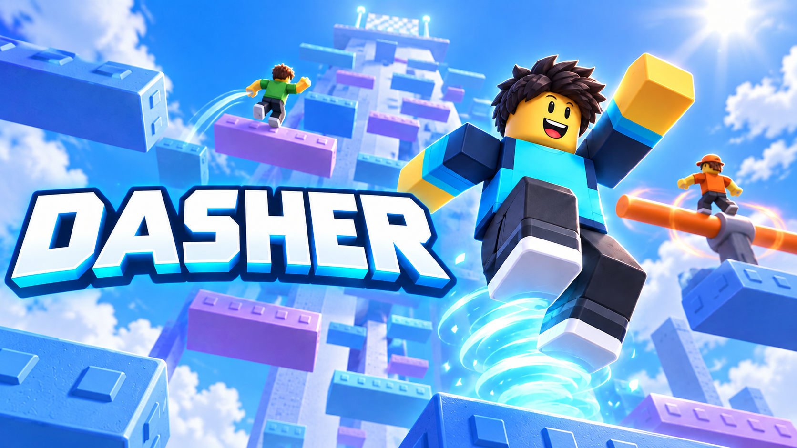

# Dasher — Ascent 0.7

A competitive Roblox tower obby built around route choice, recoverable falls and one limited **Updraft**. Climb Helix, Canopy and Reactor, vote for the next tower and spend earned coins on cosmetic effects.

**Concept, game design and creative direction: Kuzey (Lloydhf).** Implementation, testing, build tooling and documentation include OpenAI Codex assistance. [Design case study](docs/PORTFOLIO.md) · [Turkish play guide](BASLA.md) · [Verification](docs/TESTING.md)

*AI-generated promotional illustration, created on 7 October 2026; not a gameplay screenshot. [Artwork files and provenance](assets/branding/README.md).*

## Open the game

Download and extract **[Dasher-Studio.zip](Dasher-Studio.zip)**, open **Dasher.rbxlx** in Roblox Studio and press **F5**. If double-clicking the file does not work, use **File → Open from File** in Studio. No external Studio plugin, API key or paid asset is required.

The source and editable geometry are included. Rebuild with `python tools/build.py`. The current **0.7 local release was completed on 8 October 2026**; this GitHub update does not publish a Roblox experience. The live deployment has not been verified to match this version.

## What changed in 0.7

- **Open-air towers:** enclosing walls and detached decorations were removed; matte surfaces, attached edge accents and different palettes keep the route readable.
- **Reliable movement:** automatic speed/flight corrections that pulled legitimate players backward were removed. Hazards, falls into the void and manual resets retain their normal behavior.
- **Hold to restart:** hold **R**, controller **Y** or the reset button for **1.1 seconds**. Early release, menus/chat or lost focus cancel the hold; the HUD displays progress.
- **Precise finishes:** stand on the marked summit pad to finish. Passing its approach or moving below it does not complete the race.
- **Camera and countdown:** route-facing intros return control before the final 3–2–1; shared server deadlines keep the start signal aligned with movement release.
- **Social lobby:** four vendors offer branching conversations and services; animated menus keep the racing HUD compact.

## Play loop and progression

Vote during an **18-second intermission**, prepare during an **8-second countdown**, then race for up to **7 minutes**. The first finish caps the remaining time at **90 seconds**. Results last **10 seconds** before the next vote. The roster supports ten entrants; the published experience's server capacity also needs to be configured to ten.

**Q** activates Updraft with a **3.25-second cooldown** and a required landing before reuse. The three towers each have eight sectors, 64 main-route platforms and alternate routes. Lower ledges can catch a fall; they are physical recovery opportunities, not saved checkpoints. Avatars cannot attack or push one another.

Each new sector pays **3 coins and 25 XP**, once per round. A finish adds **14 coins**, podium bonuses **6 / 3 / 1** and finish XP. Restarting cannot repeat a paid reward. Ten cosmetic particle effects change appearance without improving movement. Daily and weekly objectives remain; Robux purchases are disabled.

Balances, cosmetics and XP retain the existing profile format. CourseVersion **6** separates records for the changed routes. Studio uses temporary profiles; updating the same published experience is necessary to retain its player data.

## Inspect the project

| Area | Files |
| --- | --- |
| Client input, HUD, conversations and camera | [Client notes](docs/CLIENT.md), `src/client/` |
| Race lifecycle, rewards and moving surfaces | [Server notes](docs/SERVER.md), `src/server/` |
| Balance, shared clock and reset-hold state | `src/shared/Config.luau`, `RoundClock.luau`, `ResetHold.luau` |
| Editable maps, lobby and Python builder | [Map design](docs/MAP-DESIGN.md), `tools/` |
| Reproducible checks | [Test instructions](tests/README.md) |

The 8 October GitHub refresh rebuilt the production place byte-for-byte, checked all **10 embedded scripts**, and passed **560 deterministic checks/replays**, **6 geometry tests** covering 339 route corridors, and the camera geometry audit. Archived native evidence was revalidated against this same source and geometry: all **192 main platforms** were traversed, with no unexpected resets or detected game-script runtime errors. The separate hold-UI session passed early-release, menu-cancel and one-reset-per-hold checks. [Dated evidence and limits](docs/TESTING.md).

Real ten-client load, physical mobile/controller hardware, live persistence and human difficulty/retention testing remain outstanding. The separate [onboarding research proposal](https://github.com/Lloydhf/game-design-research) has not been run as an experiment in this build.

Earlier [Ascent 0.5 documentation](docs/history-v0.5/INDEX.md) and [Next 0.2 documentation](docs/history-v0.2/INDEX.md) remain available. Geometry and UI were constructed for this project; Roblox built-in resources remain subject to Roblox terms. This repository does not currently grant an open-source license.
